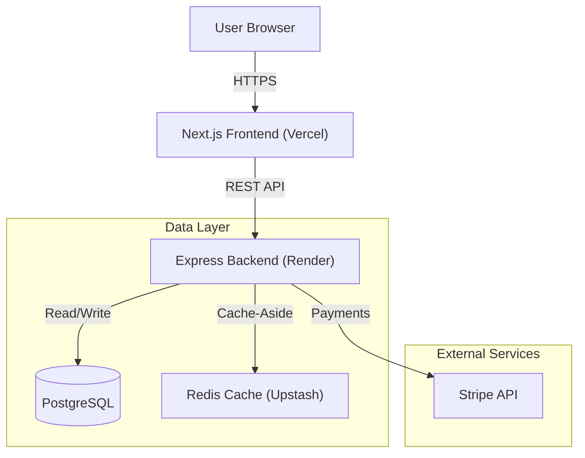

# Blog Lounge 🚀

> **A High-Scale Distributed Content Platform** designed to demonstrate Senior Engineering principles: Caching, Rate Limiting, Idempotency, and Microservices Architecture.

## 🏗️ System Architecture

This project is not just a blog; it's a simulation of a production-grade distributed system.

## 🌟 Key Engineering Features

### 1. Distributed Caching (Redis)
Implemented the **Cache-Aside Pattern** to minimize database load and reduce latency.
- **Read**: Checks Redis first (`GET posts:all`). If miss, queries DB and sets cache (TTL: 5 mins).
- **Write**: Invalidates cache on new post creation (`DEL posts:all`) to ensure consistency.

### 2. Rate Limiting (DDoS Protection)
Custom middleware using Redis to track request counts per IP.
- **Algorithm**: Fixed Window Counter.
- **Limit**: 100 requests / 15 minutes.
- **Why**: Protects the API from abuse and ensures fair usage in a distributed environment.

### 3. Idempotency (Safe Payments)
Middleware to prevent "Double Charge" issues in payment processing.
- **Mechanism**: Clients send a unique `Idempotency-Key` header.
- **Logic**: Server caches the response of successful requests in Redis. If the same key is received, the cached response is returned immediately without re-processing the payment.

### 4. Containerization (DevOps)
Full Docker support for local development, orchestrating:
- **Backend**: Node.js 20 (Alpine)
- **Database**: PostgreSQL 15
- **Cache**: Redis (Alpine)

## 🛠️ Tech Stack

- **Frontend**: Next.js 14 (App Router), Tailwind CSS, Framer Motion.
- **Backend**: Node.js, Express, TypeScript.
- **Database**: PostgreSQL (via Prisma ORM).
- **Infrastructure**: Docker, Docker Compose.

## 🚀 Getting Started

### Why PostgreSQL over MongoDB?
While the original project used MongoDB, I migrated to **PostgreSQL** to demonstrate relational data modeling. Users, Posts, and Comments have strict relationships that are better enforced by SQL constraints, ensuring data integrity at scale.

### Why Redis for Rate Limiting?
In-memory storage is required for the speed of rate limiting checks. Redis allows this state to be shared across multiple backend instances (horizontal scaling), whereas local memory would fail in a distributed cluster.

---
*Built as a Portfolio Project for Senior Software Engineering roles.*
